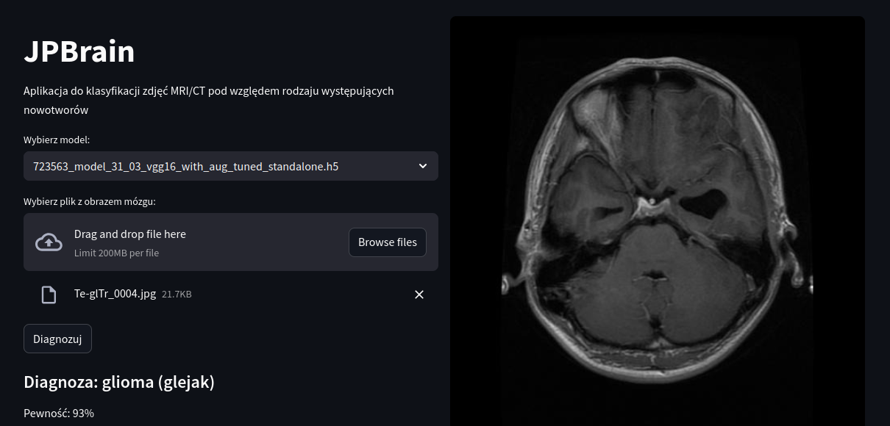

## JPBrain

It is a project of ML model and simple application to brain tumor classification based on MRI/CT scan.


### Prerequsites:
1. Python libraries
```
pip install tensorflow kagglehub numpy pandas matplotlib scikit-learn seaborn opencv-python streamlit
```
2. Jupyter  Nootbook

### Local dataset installation:

Installation prepared for linux system with python
```
./install_dataset
```
### Directories in project:
- deployment - streamlit app files
- models - saved models
- plots - plots used in notebooks
- test_img - additional images used in some tests
- docs - documentation

### Application in Streamlit

```
streamlit run streamlit_app.py --server.address=127.0.0.1
```



